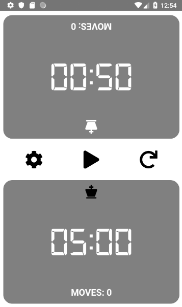
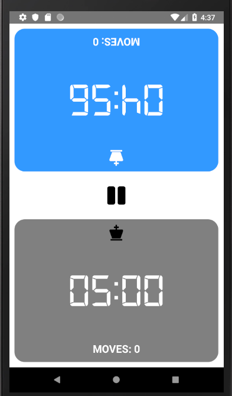
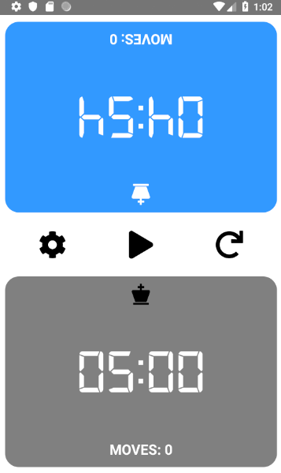
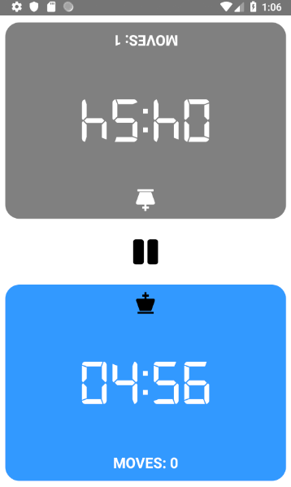
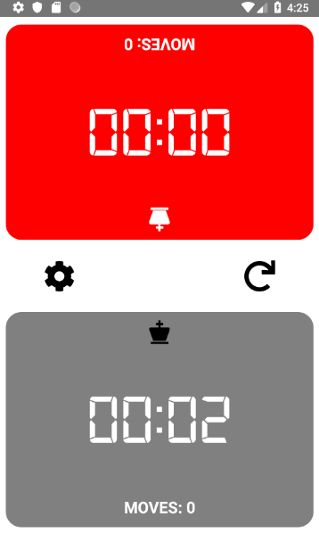
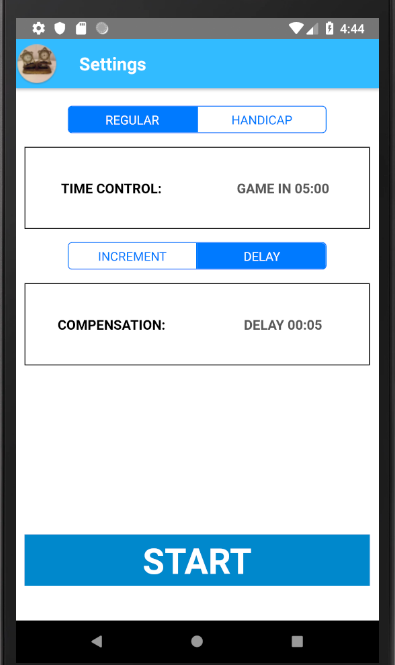
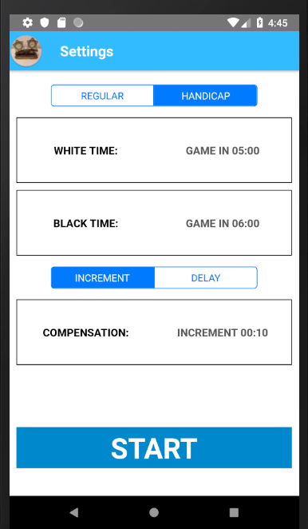
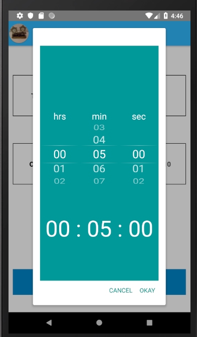
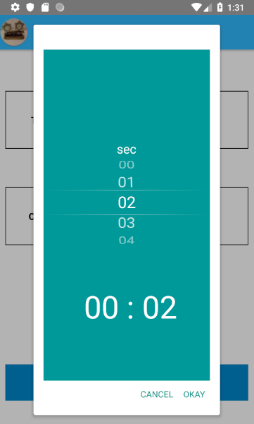

# chessClock
This is a simple chess clock for android built using React Native.

## Features

* The ability to set a time by tapping the button with the current time.

* A player's initial time can be at most 23 hours, 59 minutes and 59 seconds.

* There are two ways of setting a player's initial time:
  - Regular: Both players receive the same amount of time set.

  - Handicap: The times for both players are set individually.

* A player can receive time compensation of up to 59 seconds.

* A player can receive one of two modes of time compensation:
  - Increment: A player has the compensation time added to their current time after pressing the clock.

  - Delay: A player's time does not start ticking down until after the compensation time has passed.

* The clock can be paused.

* The clock can be reset.

* Easy navigation from the home screen to the settings screen.

* A sound that is played when the clock is pressed.

* The app saves the time settings in memory, so they can be accessible the next time the app is opened.

